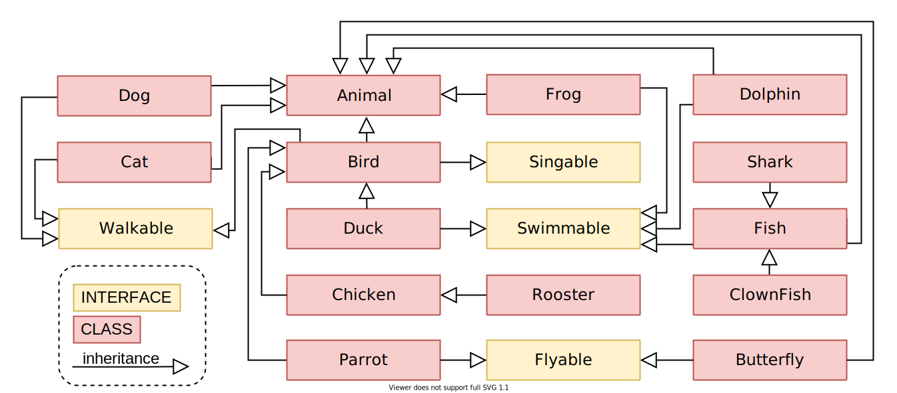

# ZOO

* A. Basics : [BirdTest.java](https://github.com/johnth1902/zoo/blob/main/src/test/java/com/example/zoo/model/BirdTest.java)
* B. Model Fish : [FishTest.java](https://github.com/johnth1902/zoo/blob/main/src/test/java/com/example/zoo/model/FishTest.java)
* C. Model Butterfly : [ButterflyTest.java](https://github.com/johnth1902/zoo/blob/main/src/test/java/com/example/zoo/model/ButterflyTest.java)
* D. Counting Animals : [AnimalTest.java](https://github.com/johnth1902/zoo/blob/main/src/test/java/com/example/zoo/model/AnimalTest.java)
* REST Controller : [ZooController.java](https://github.com/johnth1902/zoo/blob/main/src/main/java/com/example/zoo/ZooController.java), [Swagger](http://65.2.0.75:8888/swagger-ui/index.html?configUrl=/v3/api-docs/swagger-config)

##### REST URLs
* [Bird](http://65.2.0.75:8888/behavior?className=Bird), [Duck](http://65.2.0.75:8888/behavior?className=Duck), [Chicken](http://65.2.0.75:8888/behavior?className=Chicken), [Rooster](http://65.2.0.75:8888/behavior?className=Rooster), [Parrot](http://65.2.0.75:8888/behavior?className=Parrot)
* [Fish](http://65.2.0.75:8888/behavior?className=Fish), [Shark](http://65.2.0.75:8888/behavior?className=Shark), [Clownfish](http://65.2.0.75:8888/behavior?className=Clownfish), [Dolphin](http://65.2.0.75:8888/behavior?className=Dolphin)
* [Butterfly](http://65.2.0.75:8888/behavior?className=Butterfly)